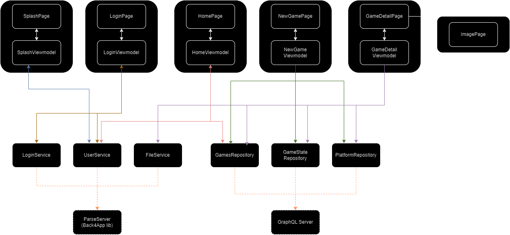

# GameTag

### App para biblioteca de jogos
Nele será possível
- Adicionar um jogo, definindo o nome, publicadora, plataforma, quantas horas até agora, estado (concluido, a jogar, jogando...), nota
- Listar a biblioteca de jogos
- Alterar um registro de um jogo
- Adicionar prints de momentos impactantes do jogo

### Arquitetura
A arquitetura segue um padrão MVVM para UIs, sendo sua camada de Model composta por Services e Repositories

- View -> Exibição de componentes de UI
- Viewmodel -> Gestão de estado da UI e validações
- Model 
    - Services -> Consumo de dados pela biblioteca ParseServer (Back4App)
    - Repositories -> Gestão de dados por meio do GraphQL server

